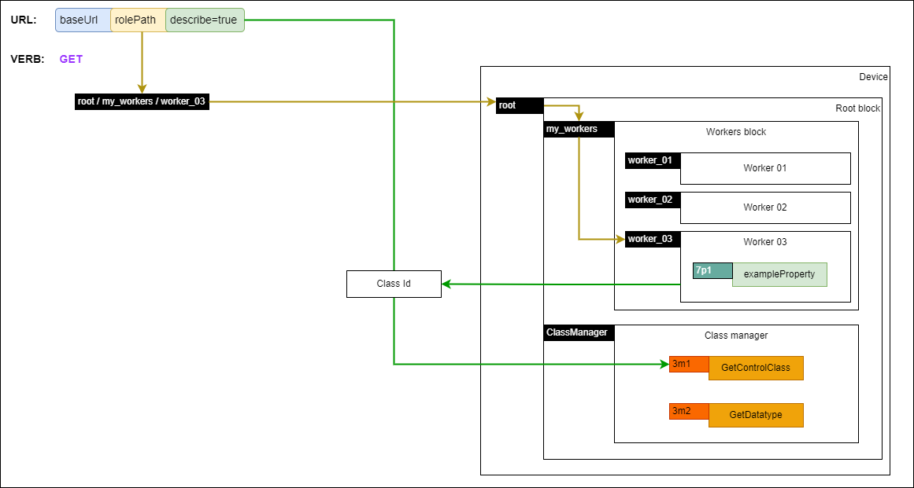
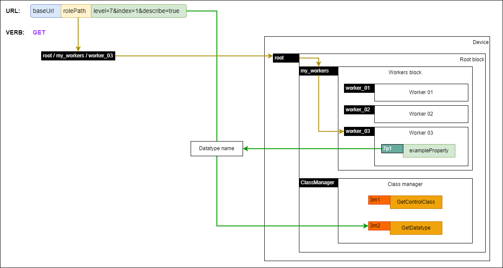
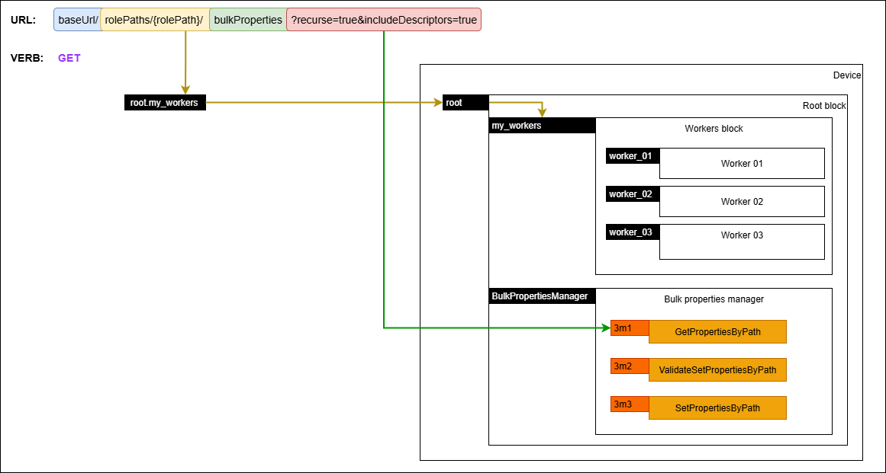
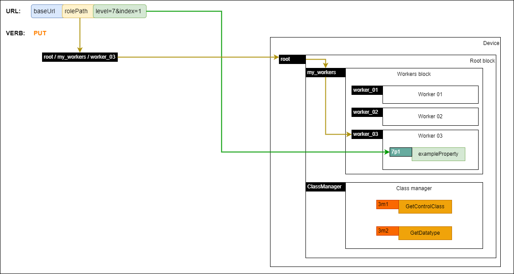
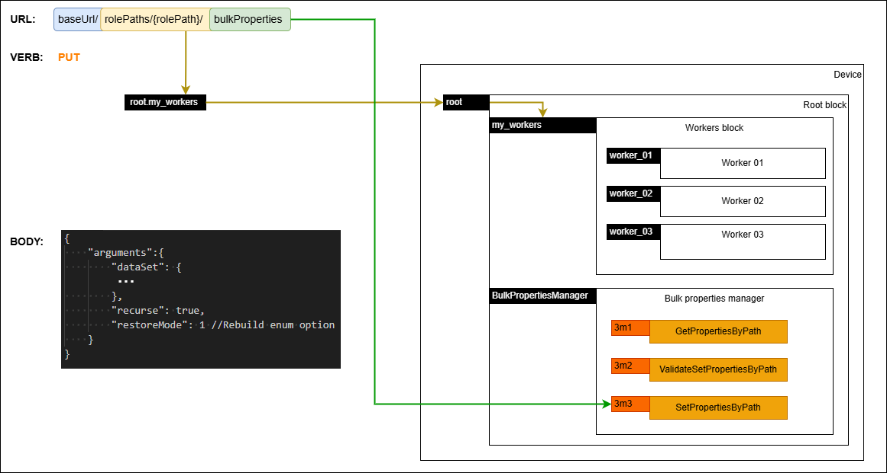
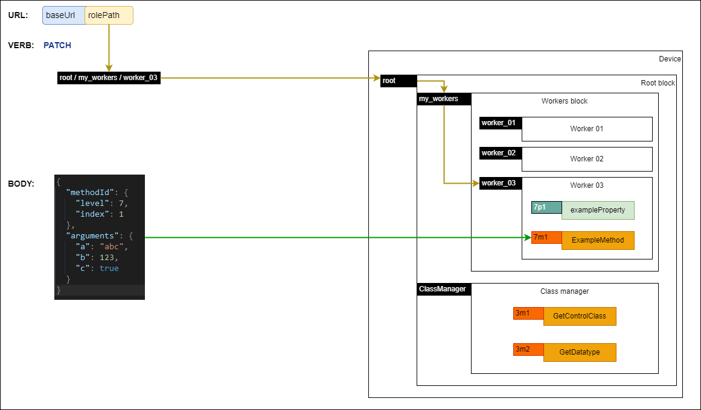

# API requests

The endpoints are documented in the [Configuration API](https://specs.amwa.tv/is-14/branches/v1.0-dev/APIs/ConfigurationAPI.html).

## Control session

Concurrency control is left to specific device implementations, however devices MUST always return relevant error response messages and statuses when there are conflicts, errors or other noteworthy states.

## URL and usage

Clients MUST use the 'control' endpoint URL provided in the [IS-04 device](IS-04%20interactions.md) as the base URL for all subsequent requests.

As described in the Configuration API, the [rolePaths](https://specs.amwa.tv/is-14/branches/v1.0-dev/APIs/ConfigurationAPI.html#rolepaths_get) endpoint MUST return all the device model's role paths. Each `rolePath` MUST be created by appending [NcObject roles](https://specs.amwa.tv/ms-05-02/latest/docs/NcObject.html) starting with the `root block` and using `.` as the delimiter. Consequently the `.` character MUST not be used inside individual object roles.

It is RECOMMENDED for device model objects roles to use `Unreserved Characters` as described in [RFC 3986 - 2.3. Unreserved Characters](https://www.ietf.org/rfc/rfc3986.txt). When `Reserved Characters` are used in an object role, they MUST be URL encoded when included in the `rolePaths` endpoint and subsequently in a URL.

Device model object roles are case sensitive and thus any `rolePaths` and URLs which include them are also case sensitive as described in [RFC 7230](https://datatracker.ietf.org/doc/html/rfc7230#section-2.7.3).

Property identifiers used as part of a URL MUST be represented as a string of the format `{propertyLevel}p{propertyIndex}` where:

- propertyLevel - number representing the inheritance level of the class containing the property (see [Control Classes](https://specs.amwa.tv/ms-05-02/latest/docs/Framework.html#control-classes))
- propertyIndex - number representing the index level of the property within the specified inheritance level (see [Control Classes](https://specs.amwa.tv/ms-05-02/latest/docs/Framework.html#control-classes))

Method identifiers used as part of a URL MUST be represented as a string of the format `{methodLevel}m{methodIndex}` where:

- methodLevel - number representing the inheritance level of the class containing the method (see [Control Classes](https://specs.amwa.tv/ms-05-02/latest/docs/Framework.html#control-classes))
- methodIndex - number representing the index level of the method within the specified inheritance level (see [Control Classes](https://specs.amwa.tv/ms-05-02/latest/docs/Framework.html#control-classes))

As an example, for a given base URL, clients can target the `root` block by using `{baseUrl}/root` as the URL. Furthermore, clients can target the [userLabel](https://specs.amwa.tv/ms-05-02/latest/docs/Framework.html#ncobject) of the `root` block by using `{baseUrl}/rolePaths/root/properties/1p6/value` as the URL.

The following subsections define common use cases for the applicable HTTP verbs where resources are located using their associated `rolePath`.

| Verb    | Scenario                                                                                                | URL format                                                      | Body                                                                                                                               | Response                                                                                                                                                                                               |
| ------- | ------------------------------------------------------------------------------------------------------- | --------------------------------------------------------------- | ---------------------------------------------------------------------------------------------------------------------------------- | ------------------------------------------------------------------------------------------------------------------------------------------------------------------------------------------------------ |
| GET     | [Get a property](#getting-a-property)                                                                   | baseUrl/rolePaths/{rolePath}/properties/{propertyId}/value      | N/A                                                                                                                                | [NcMethodResultPropertyValue](https://specs.amwa.tv/ms-05-02/latest/docs/Framework.html#ncmethodresultpropertyvalue) with the contents of the property                                                 |
| GET     | [Get class descriptor](#getting-the-class-descriptor-of-an-object)                                      | baseUrl/rolePaths/{rolePath}/descriptor                         | N/A                                                                                                                                | [NcMethodResultClassDescriptor](https://specs.amwa.tv/ms-05-02/latest/docs/Framework.html#ncmethodresultclassdescriptor)                                                                               |
| GET     | [Get datatype descriptor](#getting-the-datatype-descriptor-of-a-property)                               | baseUrl/rolePaths/{rolePath}/properties/{propertyId}/descriptor | N/A                                                                                                                                | [NcMethodResultDatatypeDescriptor](https://specs.amwa.tv/ms-05-02/latest/docs/Framework.html#ncmethodresultdatatypedescriptor)                                                                         |
| GET     | [Getting all the properties of a role path](#getting-all-the-properties-of-a-role-path)                 | baseUrl/rolePaths/{rolePath}/bulkProperties?recurse={value}     | N/A                                                                                                                                | [NcMethodResultBulkValuesHolder](https://specs.amwa.tv/nmos-control-feature-sets/branches/main/device-configuration/#ncmethodresultbulkvaluesholder)                           |
| PUT     | [Modify a property](#changing-a-property)                                                               | baseUrl/rolePaths/{rolePath}/properties/{propertyId}/value      | [property-value-put-request](https://specs.amwa.tv/is-14/branches/v1.0-dev/APIs/schemas/property-value-put-request.json)           | [NcMethodResult](https://specs.amwa.tv/ms-05-02/latest/docs/Framework.html#ncmethodresult)                                                                                                             |
| PUT     | [Setting bulk properties for a role path](#setting-bulk-properties-for-a-role-path)       | baseUrl/rolePaths/{rolePath}/bulkProperties                     | [bulkProperties-set-request](https://specs.amwa.tv/is-14/branches/v1.0-dev/APIs/schemas/bulkProperties-set-request.json)           | [NcMethodResultObjectPropertiesSetValidation](https://specs.amwa.tv/nmos-control-feature-sets/branches/main/device-configuration/#ncmethodresultobjectpropertiessetvalidation) |
| PATCH   | [Invoke a method](#invoking-a-method)                                                                   | baseUrl/rolePaths/{rolePath}/methods/{methodId}                 | [method-patch-request](https://specs.amwa.tv/is-14/branches/v1.0-dev/APIs/schemas/method-patch-request.json)                       | [NcMethodResult](https://specs.amwa.tv/ms-05-02/latest/docs/Framework.html#ncmethodresult)                                                                                                             |
| PATCH | [Validating bulk properties for a role path](#validating-bulk-properties-for-a-role-path) | baseUrl/rolePaths/{rolePath}/bulkProperties                     | [bulkProperties-validate-request](https://specs.amwa.tv/is-14/branches/v1.0-dev/APIs/schemas/bulkProperties-validate-request.json) | [NcMethodResultObjectPropertiesSetValidation](https://specs.amwa.tv/nmos-control-feature-sets/branches/main/device-configuration/#ncmethodresultobjectpropertiessetvalidation) |

## GET

### Getting a property

|  |
|:--:|
| _**Getting a property**_ |

Clients MUST target a specific property of an object by locating the object using its role path and the property using its property identifier and building a URL as per the following format `baseUrl/rolePaths/{rolePath}/properties/{propertyId}/value`. Devices MUST return a response of type [NcMethodResultPropertyValue](https://specs.amwa.tv/ms-05-02/latest/docs/Framework.html#ncmethodresultpropertyvalue) containing the value of that property when successful. If the request encountered an error then devices MUST return a response of type [NcMethodResultError](https://specs.amwa.tv/ms-05-02/latest/docs/Framework.html#ncmethodresulterror) or a derived datatype and include an error message.

Note that this is equivalent to invoking the generic [Get method](https://specs.amwa.tv/ms-05-02/latest/docs/NcObject.html#generic-getter-and-setter) on the specific object for the required property.

### Getting the class descriptor of an object

|  |
|:--:|
| _**Getting class descriptor**_ |

Clients MUST target a specific object in the device model and build a URL as per the following format `baseUrl/rolePaths/{rolePath}/descriptor`. Devices MUST return a response of type [NcMethodResultClassDescriptor](https://specs.amwa.tv/ms-05-02/latest/docs/Framework.html#ncmethodresultclassdescriptor) including a descriptor which has all inherited elements. If the request encountered an error then devices MUST return a response of type [NcMethodResultError](https://specs.amwa.tv/ms-05-02/latest/docs/Framework.html#ncmethodresulterror) or a derived datatype and include an error message.

Note that this is equivalent to invoking the [GetControlClass method](https://specs.amwa.tv/ms-05-02/latest/docs/Framework.html#ncclassmanager) on the [Class Manager object](https://specs.amwa.tv/ms-05-02/latest/docs/Managers.html#class-manager) and including all inherited elements.

### Getting the datatype descriptor of a property

|  |
|:--:|
| _**Getting datatype descriptor**_ |

Clients MUST target a specific property of an object by locating the object using its role path and the property using its property identifier and building a URL as per the following format `baseUrl/rolePaths/{rolePath}/properties/{propertyId}/descriptor`. Devices MUST return a response of type [NcMethodResultDatatypeDescriptor](https://specs.amwa.tv/ms-05-02/latest/docs/Framework.html#ncmethodresultdatatypedescriptor) including a descriptor which has all inherited elements. If the request encountered an error then devices MUST return a response of type [NcMethodResultError](https://specs.amwa.tv/ms-05-02/latest/docs/Framework.html#ncmethodresulterror) or a derived datatype and include an error message.

Note that this is equivalent to invoking the [GetDatatype method](https://specs.amwa.tv/ms-05-02/latest/docs/Framework.html#ncclassmanager) on the [Class Manager object](https://specs.amwa.tv/ms-05-02/latest/docs/Managers.html#class-manager) and including inherited elements.

### Getting all the properties of a role path

|  |
|:--:|
| _**Getting bulk properties**_ |

Clients MUST target a specific role path in the device model by locating the object using its role path and building a URL (optionally specifying the `recurse` parameter) as per the following format `baseUrl/rolePaths/{rolePath}/bulkProperties?recurse={true|false}`. Not including the `recurse` query parameter MUST be treated as providing a `recurse` argument of `true`. Devices MUST return a response of type [NcMethodResultBulkValuesHolder](https://specs.amwa.tv/nmos-control-feature-sets/branches/main/device-configuration/#ncmethodresultbulkvaluesholder) and MUST include all the properties of the target role path as a [bulk values holder](https://specs.amwa.tv/nmos-control-feature-sets/branches/main/device-configuration/#ncbulkvaluesholder). If the `recurse` argument is set to `true` then devices MUST include all the properties of the target role path as well as any nested role paths in the response. If the request encountered an error then devices MUST return a response of type [NcMethodResultError](https://specs.amwa.tv/ms-05-02/latest/docs/Framework.html#ncmethodresulterror) or a derived datatype and include an error message.

Note that this is equivalent to invoking the `GetPropertiesByPath` method on the [Bulk properties manager object](https://specs.amwa.tv/nmos-control-feature-sets/branches/main/device-configuration/#ncbulkpropertiesmanager).

Clients MAY perform a `full backup` or a `partial backup` by retrieving properties through the `bulkProperties` endpoint.

A `full backup` is a [backup data set](Backup%20&%20restore.md#definitions) returned by a `GET` operation on the `/bulkProperties` endpoint of the root block with the `recurse` parameter set to `true`.

A `partial backup` is a [backup data set](Backup%20&%20restore.md#definitions) returned by a `GET` operation on the `/bulkProperties` endpoint of any object of the device model, other than the root block. A partial backup can also be generated by a `GET` operation on the `/bulkProperties` endpoint of the root block with the `recurse` query parameter set to `false`; however this will only result in a backup of the root block.

## PUT

### Changing a property

|  |
|:--:|
| _**Putting a property**_ |

Clients MUST use the PUT verb when setting individual object properties.

Clients MUST target a specific property of an object by locating the object using its role path and the property using its property identifier and building a URL as per the following format `baseUrl/rolePaths/{rolePath}/properties/{propertyId}/value`. Devices MUST return a response of type [NcMethodResult](https://specs.amwa.tv/ms-05-02/latest/docs/Framework.html#ncmethodresult). If the request encountered an error then devices MUST return a response of type [NcMethodResultError](https://specs.amwa.tv/ms-05-02/latest/docs/Framework.html#ncmethodresulterror) or a derived datatype and include an error message.

Clients MUST include an object which contains the new value of the property in the body of the request as per the [property-value-put-request](https://specs.amwa.tv/is-14/branches/v1.0-dev/APIs/schemas/property-value-put-request.json) schema.

Note that this is equivalent to invoking the generic [Set method](https://specs.amwa.tv/ms-05-02/latest/docs/NcObject.html#generic-getter-and-setter) on the specific object for the required property.

### Setting bulk properties for a role path

|  |
|:--:|
| _**Setting bulk properties**_ |

Clients MUST use the PUT verb for setting a bulk properties data set.

Clients MUST target a specific role path in the device model by locating the object using its role path and building a URL as per the following format `baseUrl/rolePaths/{rolePath}/bulkProperties`.

Clients MUST include an object which contains an `arguments` object with `dataSet`, `recurse` and `restoreMode` sub elements in the body of the request as per the [bulkProperties-set-request](https://specs.amwa.tv/is-14/branches/v1.0-dev/APIs/schemas/bulkProperties-set-request.json) schema.

```json
{
    "arguments": {
        "dataSet": {
            ...
        },
        "recurse": true,
        "restoreMode": 1
    }
}
```

In their attempt to use the provided `dataSet`, devices MUST target the properties of the target role path and all nested role paths when the body of the request contains the `recurse` value set to `true`.

Devices MUST return a response of type [NcMethodResultObjectPropertiesSetValidation](https://specs.amwa.tv/nmos-control-feature-sets/branches/main/device-configuration/#ncmethodresultobjectpropertiessetvalidation). If the request encountered an error then devices MUST return a response of type [NcMethodResultError](https://specs.amwa.tv/ms-05-02/latest/docs/Framework.html#ncmethodresulterror) or a derived datatype and include an error message.

Note that this is equivalent to invoking the `SetPropertiesByPath` method inside the [Bulk properties manager object](https://specs.amwa.tv/nmos-control-feature-sets/branches/main/device-configuration/#ncbulkpropertiesmanager).

Setting properties through the `bulkProperties` endpoint allows a user to perform a restore.

## PATCH

### Invoking a method

|  |
|:--:|
| _**Invoking a method**_ |

Clients MUST use the PATCH verb when invoking object methods.

Clients MUST target a specific method of an object by locating the object using its role path and the method using its method identifier and building a URL as per the following format `baseUrl/rolePaths/{rolePath}/methods/{methodId}`.

Clients MUST include an object which contains an `arguments` object in the body of the request as per the [method-patch-request](https://specs.amwa.tv/is-14/branches/v1.0-dev/APIs/schemas/method-patch-request.json) schema. For methods which do not have arguments defined clients MUST include an empty `arguments` object in the request body.

```json
{
    "arguments": {
        ...
    }
}
```

Devices MUST return a response of type [NcMethodResult](https://specs.amwa.tv/ms-05-02/latest/docs/Framework.html#ncmethodresult). If the request encountered an error then devices MUST return a response of type [NcMethodResultError](https://specs.amwa.tv/ms-05-02/latest/docs/Framework.html#ncmethodresulterror) or a derived datatype and include an error message.

Note that this is equivalent to invoking the specified method.

### Validating bulk properties for a role path

|  |
|:--:|
| _**Validating bulk properties**_ |

Clients MUST use the PATCH verb for validating a bulk properties data set.

Clients MUST target a specific role path in the device model by locating the object using its role path and building a URL as per the following format `baseUrl/rolePaths/{rolePath}/bulkProperties`.

Clients MUST include an object which contains an `arguments` object with `dataSet`, `recurse` and `restoreMode` sub elements in the body of the request as per the [bulkProperties-validate-request](https://specs.amwa.tv/is-14/branches/v1.0-dev/APIs/schemas/bulkProperties-validate-request.json) schema.

```json
{
    "arguments": {
        "dataSet": {
            ...
        },
        "recurse": true,
        "restoreMode": 1
    }
}
```

In their attempt to use the provided `dataSet`, devices MUST target the properties of the target role path and all nested role paths when the body of the request contains the `recurse` value set to `true`.

Devices MUST return a response of type [NcMethodResultObjectPropertiesSetValidation](https://specs.amwa.tv/nmos-control-feature-sets/branches/main/device-configuration/#ncmethodresultobjectpropertiessetvalidation). If the request encountered an error then devices MUST return a response of type [NcMethodResultError](https://specs.amwa.tv/ms-05-02/latest/docs/Framework.html#ncmethodresulterror) or a derived datatype and include an error message.

Devices MUST NOT make any changes to the device model when validating bulk properties.

Note that this is equivalent to invoking the `ValidateSetPropertiesByPath` method inside the [Bulk properties manager object](https://specs.amwa.tv/nmos-control-feature-sets/branches/main/device-configuration/#ncbulkpropertiesmanager).

Clients MAY use this validation mechanism before attempting to perform a restore by applying [bulk properties](#setting-bulk-properties-for-a-role-path).
