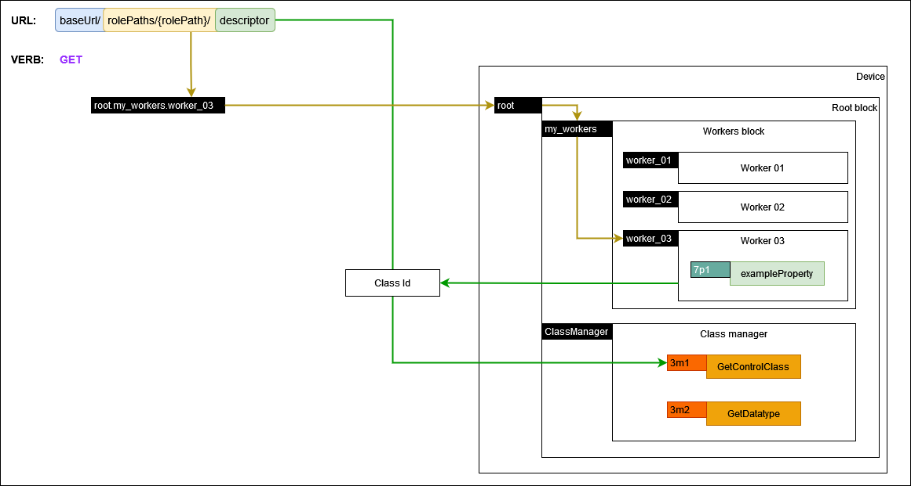
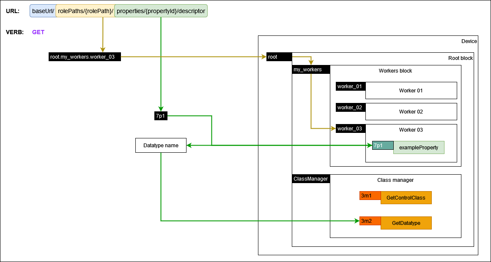
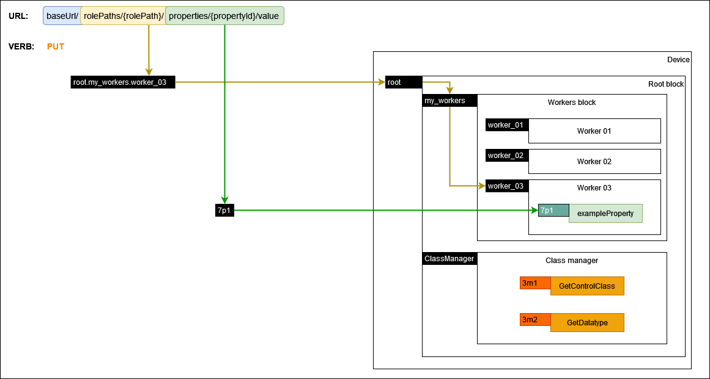

# API requests

All request results MUST return a response which inherits from the base [NcMethodResult](https://specs.amwa.tv/ms-05-02/latest/docs/Framework.html#ncmethodresult) that contains a status of type [NcMethodStatus](https://specs.amwa.tv/ms-05-02/latest/docs/Framework.html#ncmethodstatus). If the method call encountered an error then the response result returned MUST inherit from [NcMethodResultError](https://specs.amwa.tv/ms-05-02/latest/docs/Framework.html#ncmethodresulterror) and include an errorMessage of type [NcString](https://specs.amwa.tv/ms-05-02/latest/docs/Framework.html#primitives).

## Control session

Concurrency control is left to specific device implementations, however devices MUST always return relevant error response messages and statuses when there are conflicts, errors or other noteworthy states (see [Error response messages](#error-response-messages)).

## URL and query parameters usage

The URL provided in the [IS-04 device](IS-04%20interactions.md) is used as the base URL for all subsequent requests.

The device model of the device can be navigated by appending [NcObject roles](https://specs.amwa.tv/ms-05-02/latest/docs/NcObject.html) on top of the base URL starting from the `root block` and using `/` as the delimiter.

It is RECOMMENDED for Device model objects roles to use `Unreserved Characters` as described in [RFC 3986 - 2.3. Unreserved Characters](https://www.ietf.org/rfc/rfc3986.txt). When `Reserved Characters` are used in an object role, they MUST be URL encoded when included in a URL.

Device model object roles are case sensitive and thus any URLs which include them are also case sensitive as described in [RFC 7230](https://datatracker.ietf.org/doc/html/rfc7230#section-2.7.3).

This means for a given base URL the `root` block can be targeted by using `{baseUrl}/root` as the URL.

Query parameters MUST be used to target properties or methods for a particular object located by URL.

This means using the base URL the [userLabel](https://specs.amwa.tv/ms-05-02/latest/docs/Framework.html#ncobject) of the `root` block can be targeted by using `{baseUrl}/root?level=1&index=6` as the URL.

All HTTP requests map to invoking methods on the resources located by the URL.

The following subsections define use cases for the applicable HTTP verbs where resources are located using a URL format where the following are defined:

- baseUrl - href advertised in the controls of the [IS-04 device](IS-04%20interactions.md)
- rolePath - string obtained by appending [NcObject roles](https://specs.amwa.tv/ms-05-02/latest/docs/NcObject.html) on top of the base URL starting from the `root block` and using `/` as the delimiter
- propertyLevel - number representing the inheritance level of the class containing the property (see [Control Classes](https://specs.amwa.tv/ms-05-02/latest/docs/Framework.html#control-classes))
- propertyIndex - number representing the index level of the property within the specified inheritance level (see [Control Classes](https://specs.amwa.tv/ms-05-02/latest/docs/Framework.html#control-classes))

| Verb  | Scenario                                                                  | URL format                                                                     | Condition                                                          | Body                                                                                                                          | Response                                                                                                                                                         |
| ----- | ------------------------------------------------------------------------- | ------------------------------------------------------------------------------ | ------------------------------------------------------------------ | ----------------------------------------------------------------------------------------------------------------------------- | ---------------------------------------------------------------------------------------------------------------------------------------------------------------- |
| GET   | [Get a property](#getting-a-property)                                     | {baseUrl}/{rolePath}?level={propertyLevel}&index={propertyIndex}               | The URL and query parameters target a specific object and property | N/A                                                                                                                           | [NcMethodResultPropertyValue](https://specs.amwa.tv/ms-05-02/latest/docs/Framework.html#ncmethodresultpropertyvalue) with the contents of the property           |
| GET   | [Get block members](#getting-the-members-of-a-block)                      | {baseUrl}/{rolePath}                                                           | The URL targets a specific block                                   | N/A                                                                                                                           | [NcMethodResultPropertyValue](https://specs.amwa.tv/ms-05-02/latest/docs/Framework.html#ncmethodresultpropertyvalue) with the contents of the `members` property |
| GET   | [Get class descriptor](#getting-the-class-descriptor-of-an-object)        | {baseUrl}/{rolePath}?describe=true                                             | The URL targets a specific object                                  | N/A                                                                                                                           | [NcMethodResultClassDescriptor](https://specs.amwa.tv/ms-05-02/latest/docs/Framework.html#ncmethodresultclassdescriptor)                                         |
| GET   | [Get datatype descriptor](#getting-the-datatype-descriptor-of-a-property) | {baseUrl}/{rolePath}?level={propertyLevel}&index={propertyIndex}&describe=true | The URL and query parameters target a specific object and property | N/A                                                                                                                           | [NcMethodResultDatatypeDescriptor](https://specs.amwa.tv/ms-05-02/latest/docs/Framework.html#ncmethodresultdatatypedescriptor)                                   |
| PUT   | [Modify a property](#put)                                                 | {baseUrl}/{rolePath}?level={propertyLevel}&index={propertyIndex}               | The URL and query parameters target a specific object and property | [modify-property schema](https://specs.amwa.tv/is-device-configuration/branches/publish-CR/APIs/schemas/modify-property.html) | [NcMethodResult](https://specs.amwa.tv/ms-05-02/latest/docs/Framework.html#ncmethodresult)                                                                       |
| PATCH | [Invoke a method](#patch)                                                 | {baseUrl}/{rolePath}                                                           | The URL targets a specific object                                  | [invoke-method schema](https://specs.amwa.tv/is-device-configuration/branches/publish-CR/APIs/schemas/invoke-method.html)     | [NcMethodResult](https://specs.amwa.tv/ms-05-02/latest/docs/Framework.html#ncmethodresult)                                                                       |

## GET

### Getting a property

|  |
|:--:|
| _**Getting a property**_ |

The URL MUST target a specific property of an object by locating the object using its role path and adding `level` and `index` query parameters. The response MUST be of type [NcMethodResultPropertyValue](https://specs.amwa.tv/ms-05-02/latest/docs/Framework.html#ncmethodresultpropertyvalue) with the contents of that property.

This is equivalent to invoking the generic [Get method](https://specs.amwa.tv/ms-05-02/latest/docs/NcObject.html#generic-getter-and-setter) on the specific object for the required property.

The following table explains the HTTP status and NcMethodStatus codes and the relevant scenarios.

| Scenario                                                                                                         | HTTP status code | NcMethodStatus code |
| ---------------------------------------------------------------------------------------------------------------- | ---------------- | ------------------- |
| Request is successful                                                                                            | 200              | 200                 |
| Object cannot be found using the offered baseUrl and rolePath                                                    | 404              | 404                 |
| Object is located successfully via rolePath but the desired property located via query parameters does not exist | 404              | 502                 |
| The property and object are located successfully but the value cannot be retrieved for any reason                | 500              | 500                 |

### Getting the members of a block

|  |
|:--:|
| _**Getting block members**_ |

The URL MUST target a specific block object in the device model and MUST NOT contain any query parameters. Devices MUST treat this as a request to retrieve the [members](https://specs.amwa.tv/ms-05-02/latest/docs/Blocks.html#device-model-discovery) property of that block. The response MUST be of type [NcMethodResultPropertyValue](https://specs.amwa.tv/ms-05-02/latest/docs/Framework.html#ncmethodresultpropertyvalue) with the contents of the `members` property. The response MUST be the same to the one received when appending the `level` and `index` query parameters and targeting the `members` property as described in [Getting a property](#getting-a-property).

This is equivalent to invoking the generic [Get method](https://specs.amwa.tv/ms-05-02/latest/docs/NcObject.html#generic-getter-and-setter) on the specific object for the `members` property.

The following table explains the HTTP status and NcMethodStatus codes and the relevant scenarios.

| Scenario                                                                                                                                                       | HTTP status code | NcMethodStatus code |
| -------------------------------------------------------------------------------------------------------------------------------------------------------------- | ---------------- | ------------------- |
| Request is successful                                                                                                                                          | 200              | 200                 |
| Object cannot be found using the offered baseUrl and rolePath                                                                                                  | 404              | 404                 |
| Object is located successfully via rolePath but the desired property located via query parameters does not exist for example because the object is not a block | 404              | 502                 |
| The property and object are located successfully but the value cannot be retrieved for any reason                                                              | 500              | 500                 |

### Getting the class descriptor of an object

|  |
|:--:|
| _**Getting class descriptor**_ |

The URL MUST target a specific object in the device model and include the `describe=true` query parameter. Devices treat this as a request to retrieve the [class descriptor](https://specs.amwa.tv/ms-05-02/latest/docs/Framework.html#ncclassdescriptor) of that object's class and MUST return a response of type [NcMethodResultClassDescriptor](https://specs.amwa.tv/ms-05-02/latest/docs/Framework.html#ncmethodresultclassdescriptor) with a descriptor which includes all inherited elements.

This is equivalent to invoking the [GetControlClass method](https://specs.amwa.tv/ms-05-02/latest/docs/Framework.html#ncclassmanager) on the [Class Manager object](https://specs.amwa.tv/ms-05-02/latest/docs/Managers.html#class-manager) and including all inherited elements.

The following table explains the HTTP status and NcMethodStatus codes and the relevant scenarios.

| Scenario                                                                              | HTTP status code | NcMethodStatus code |
| ------------------------------------------------------------------------------------- | ---------------- | ------------------- |
| Request is successful                                                                 | 200              | 200                 |
| Object cannot be found using the offered baseUrl and rolePath                         | 404              | 404                 |
| Object is located successfully via rolePath but class descriptor cannot be retrieved  | 500              | 500                 |

### Getting the datatype descriptor of a property

|  |
|:--:|
| _**Getting datatype descriptor**_ |

The URL MUST target a specific property of an object by locating the object using its role path and adding `level`, `index` and `describe=true` query parameters. Devices treat this as a request to retrieve the [datatype descriptor](https://specs.amwa.tv/ms-05-02/latest/docs/Framework.html#ncdatatypedescriptor) of that property and MUST return a response of type [NcMethodResultDatatypeDescriptor](https://specs.amwa.tv/ms-05-02/latest/docs/Framework.html#ncmethodresultdatatypedescriptor) with a descriptor which includes all inherited elements.

This is equivalent to invoking the [GetDatatype method](https://specs.amwa.tv/ms-05-02/latest/docs/Framework.html#ncclassmanager) on the [Class Manager object](https://specs.amwa.tv/ms-05-02/latest/docs/Managers.html#class-manager) and including all inherited elements.

The following table explains the HTTP status and NcMethodStatus codes and the relevant scenarios.

| Scenario                                                                                                         | HTTP status code | NcMethodStatus code |
| ---------------------------------------------------------------------------------------------------------------- | ---------------- | ------------------- |
| Request is successful                                                                                            | 200              | 200                 |
| Object cannot be found using the offered baseUrl and rolePath                                                    | 404              | 404                 |
| Object is located successfully via rolePath but the desired property located via query parameters does not exist | 404              | 502                 |
| The property and object are located successfully but datatype descriptor cannot be retrieved for any reason      | 500              | 500                 |

## PUT

|  |
|:--:|
| _**Putting a property**_ |

The PUT verb MUST only be used for setting individual object properties.

The URL MUST target a specific property of an object by locating the object using its role path and adding `level` and `index` query parameters. The response MUST be of type [NcMethodResult](https://specs.amwa.tv/ms-05-02/latest/docs/Framework.html#ncmethodresult).

The body of the request MUST include an object which includes the new value of the property as per the [modify-property](https://specs.amwa.tv/is-device-configuration/branches/publish-CR/APIs/schemas/modify-property.html) schema.

This is equivalent to invoking the generic [Set method](https://specs.amwa.tv/ms-05-02/latest/docs/NcObject.html#generic-getter-and-setter) on the specific object for the required property.

The following table explains the HTTP status and NcMethodStatus codes and the relevant scenarios.

| Scenario                                                                                                         | HTTP status code | NcMethodStatus code |
| ---------------------------------------------------------------------------------------------------------------- | ---------------- | ------------------- |
| Request is successful                                                                                            | 200              | 200                 |
| Object cannot be found using the offered baseUrl and rolePath                                                    | 404              | 404                 |
| Object is located successfully via rolePath but the desired property located via query parameters does not exist | 404              | 502                 |
| The property and object are located successfully but the value cannot be set because it is readonly              | 500              | 405                 |
| The property and object are located successfully but the value cannot be set because it is not valid             | 500              | 417                 |
| The property and object are located successfully but the value cannot be set for any other reason                | 500              | 500                 |

`TODO`: Figure out how we map deprecation statuses for properties and methods.

`TBD`: Do we say for any other error status codes just use 500 as the HTTP status code?

## PATCH

|  |
|:--:|
| _**Invoking a method**_ |

The PATCH verb MUST only be used for invoking object methods.

The URL MUST target a specific object by locating the object using its role path.
The body of the request MUST include an object which includes a [methodId](https://specs.amwa.tv/ms-05-02/latest/docs/Framework.html#ncmethodid) with `level` and `index` followed by any arguments required by the method.

```json
{
    "methodId": {
        "level": ...,
        "index": ...
    },
    "arguments": {
        ...
    }
}
```

For a full schema of the required body object see the [invoke-method](https://specs.amwa.tv/is-device-configuration/branches/publish-CR/APIs/schemas/invoke-method.html) schema.

The response MUST be of type [NcMethodResult](https://specs.amwa.tv/ms-05-02/latest/docs/Framework.html#ncmethodresult) or a derived type.

This is equivalent to invoking the specified method.

The following table explains the HTTP status and NcMethodStatus codes and the relevant scenarios.

| Scenario                                                                                                            | HTTP status code | NcMethodStatus code |
| ------------------------------------------------------------------------------------------------------------------- | ---------------- | ------------------- |
| Request is successful                                                                                               | 200              | 200                 |
| Object cannot be found using the offered baseUrl and rolePath                                                       | 404              | 404                 |
| Object is located successfully via rolePath but the desired method does not exist                                   | 404              | 501                 |
| The method and object are located successfully but the method cannot be invoked because the arguments are not valid | 500              | 417                 |
| The method and object are located successfully but the method cannot be invoked because of any other reason         | 500              | 500                 |

`TODO`: Figure out how we map deprecation statuses for properties and methods.

## Error response messages

When any request encounters an error, the response MUST be [NcMethodResultError](https://specs.amwa.tv/ms-05-02/latest/docs/Framework.html#ncmethodresulterror) or a derived datatype.

`TODO`: Capture possible HTTP status codes and NcMethodStatus values for general error responses.
