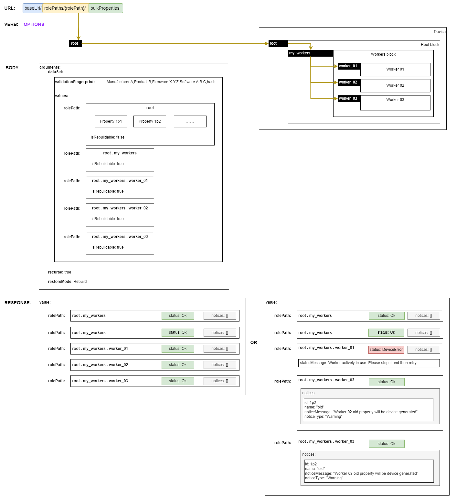

# Backup & restore

The [Configuration API](https://specs.amwa.tv/is-14/branches/v1.0-dev/APIs/ConfigurationAPI.html) defines a `bulkProperties` endpoint which allows:

- [Getting all the properties of a role path](https://specs.amwa.tv/is-14/branches/v1.0-dev/docs/API_requests.html#getting-all-the-properties-of-a-role-path)
- [Setting bulk properties for a role path](https://specs.amwa.tv/is-14/branches/v1.0-dev/docs/API_requests.html#setting-bulk-properties-for-a-role-path)
- [Validating bulk properties for a role path](https://specs.amwa.tv/is-14/branches/v1.0-dev/docs/API_requests.html#validating-bulk-properties-for-a-role-path)

These mechanisms are used for enabling backup and restore functionality and this section of the specification aims to cover the expectations, behaviour and requirements for the following scenarios:

- [Performing a backup](#1-performing-a-backup)
- Restoring a backup on the [same unit and the same version](#2-restoring-same-unit-and-same-version)
- Restoring a backup on the [same unit but different version](#3-restoring-same-unit-but-different-version)
- Restoring a backup on a [different unit using the same version](#4-restoring-different-unit-using-the-same-version)

`Note`: This does not mean that the backup & restore functionality can only be used in these scenarios.

## 1. Performing a backup

Creating a backup is performed by using the `bulkProperties` endpoint of a device alongside the [Get verb](https://specs.amwa.tv/is-14/branches/v1.0-dev/docs/API_requests.html#getting-all-the-properties-of-a-role-path).

Requests MUST use `root` as the `rolePath` alongside a query parameter `recurse=true` in order to retrieve the whole device model (full backup). The response contains a `validationFingerprint` and the `values` of all the role paths in the device model.
The `validationFingerprint` is a generic string field (format is implementation specific) which can be used by device implementations to perform quick validations when restoring. This may have information like:

- Manufacturer key
- Product key
- Firmware version
- Software version
- Backup response hash
- Whether its a full device model backup or a subset

|  |
|:--:|
| _**Performing a full backup**_ |

Partial backups can be created by choosing other role paths and using a query parameter of `recurse=false`.

## 2. Restoring same unit and same version

Assuming we have created a [full backup](#1-performing-a-backup) of our unit and we plan to use it on the same unit with the same version then we first perform a [Validation request](https://specs.amwa.tv/is-14/branches/v1.0-dev/docs/API_requests.html#validating-bulk-properties-for-a-role-path) to check if our backup can be successfully restored.

Requests MUST use `root` as the `rolePath` in order to validate the whole device model (validating a full backup).

Requests MUST include:

- the backup dataSet
- a boolean `recurse` argument set to `true` for validating the whole device model

|  |
|:--:|
| _**Validating a full backup**_ |

The response MUST include a collection of all target device model role paths with a validation `status` property. For role paths which have a `status` other than `Ok` the response MUST also include a `statusMessage` with details of why the validation failed.

We can then proceed with restoring the backup by performing a [Set request](https://specs.amwa.tv/is-14/branches/v1.0-dev/docs/API_requests.html#validating-bulk-properties-for-a-role-path) to restore our backup.

Requests MUST use `root` as the `rolePath` in order to restore the whole device model (restoring a full backup).

Requests MUST include:

- the backup dataSet
- a boolean `recurse` argument set to `true` for validating the whole device model
- a boolean `allowPartial` argument. This allows clients to control if the device should still perform a partial restore when some role paths fail validation (only of the role paths which have been validated successfully are restored)

|  |
|:--:|
| _**Restoring a full backup**_ |

The response MUST include a collection of all target device model role paths with a restore `status` property. For role paths which have a `status` other than `Ok` the response MUST also include a `statusMessage` with details of why the restore failed.

It is expected that a `full backup` performed on the same unit and restored on the same unit and same version MUST be supported by the unit.

Devices MUST allow the partial restoration of backups which have at least one role path `status` of `Ok` when supplying the `allowPartial` argument of `true` in the request.

//TODO: Do we think some devices may need to be put in maintenance mode for this to work?

## 3. Restoring same unit but different version

//TODO: Do we want to make this a MUST within the same Major version number?

## 4. Restoring different unit using the same version

// TODO: Is this a MUST?

// TBD: What if the new unit overwrites things like IP addresses? Are we saying the restore should be used as a bootstrap mechanism?
