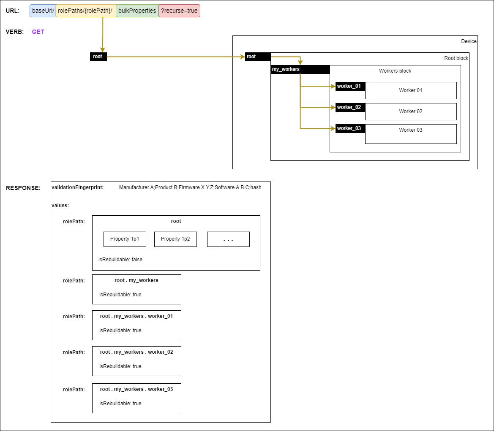
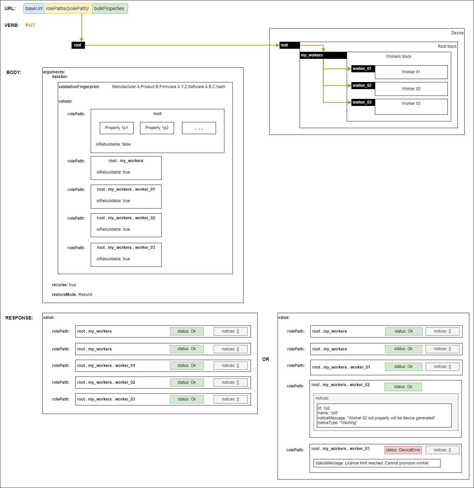

# Backup & restore

The [Configuration API](https://specs.amwa.tv/is-14/branches/v1.0-dev/APIs/ConfigurationAPI.html) defines a `bulkProperties` endpoint which allows:

- [Getting all the properties of a role path](https://specs.amwa.tv/is-14/branches/v1.0-dev/docs/API_requests.html#getting-all-the-properties-of-a-role-path)
- [Setting bulk properties for a role path](https://specs.amwa.tv/is-14/branches/v1.0-dev/docs/API_requests.html#setting-bulk-properties-for-a-role-path)
- [Validating bulk properties for a role path](https://specs.amwa.tv/is-14/branches/v1.0-dev/docs/API_requests.html#validating-bulk-properties-for-a-role-path)

These mechanisms are used for enabling backup and restore functionality and this section of the specification aims to cover the expectations, behaviour and requirements for the following scenarios:

- [Performing a backup](#1-performing-a-backup)
- Restoring a backup on the [same unit and the same software version](#2-restoring-same-unit-and-same-software-version)
- Restoring a backup on the [same unit but different software version](#3-restoring-same-unit-but-different-software-version)
- Restoring a backup on a [different unit using the same software version](#4-restoring-different-unit-using-the-same-software-version)

where `software version` means any combination of software that dictates the functionality of the device (this includes firmware).

`Note`: This does not mean that the backup & restore functionality can only be used in these scenarios.

## 1. Performing a backup

Creating a backup is performed by using the `bulkProperties` endpoint of a device alongside the [Get verb](https://specs.amwa.tv/is-14/branches/v1.0-dev/docs/API_requests.html#getting-all-the-properties-of-a-role-path).

In order to retrieve the whole device model (full backup), requests MUST use `root` as the `rolePath`. The response contains a `validationFingerprint` and the `values` of all the role paths in the device model.
The `validationFingerprint` is a generic string field (format is implementation specific) which can be used by device implementations to perform quick validations when restoring. This may have information like:

- Manufacturer key
- Product key
- Software versions
- Backup response hash
- Whether its a full device model backup or a subset

|  |
|:--:|
| _**Performing a full backup**_ |

Partial backups can be created by choosing other role paths. The scope of backups can further be restricted by using a query parameter of `recurse=false` which will only include the properties of the targeted role path.

It is RECOMMENDED to store the backup file in its entirety and not remove elements from the data set as they might contain dependencies required by some of the role paths.

## 2. Restoring same unit and same software version

Assuming a [full backup](#1-performing-a-backup) of the unit was created and is intended to be restored on the same unit with the same version then the first step is to perform a [Validation request](https://specs.amwa.tv/is-14/branches/v1.0-dev/docs/API_requests.html#validating-bulk-properties-for-a-role-path) to check if the backup can be successfully restored.

In order to validate the whole device model (validating a full backup), requests MUST use `root` as the `rolePath`.

The request body MUST include:

- the backup dataSet
- a boolean `recurse` argument (set to `true` for validating the whole device model)

|  |
|:--:|
| _**Validating a full backup**_ |

The response MUST include a collection of all target device model role paths with a validation `status` property. For role paths which have a `status` other than `Ok` the response MUST also include a `statusMessage` with details of why the validation failed.

The backup can be restored by performing a [Set request](https://specs.amwa.tv/is-14/branches/v1.0-dev/docs/API_requests.html#validating-bulk-properties-for-a-role-path) to restore the backup.

In order to restore the whole device model (restoring a full backup), requests MUST use `root` as the `rolePath`.

The request body MUST include:

- the backup dataSet
- a boolean `recurse` argument (set to `true` for validating the whole device model)
- a boolean `allowPartial` argument. This allows clients to control if the device should still perform a partial restore when some role paths fail validation (only the role paths which have been validated successfully are restored)

|  |
|:--:|
| _**Restoring a full backup**_ |

The response MUST include a collection of all target device model role paths with a restore `status` property. For role paths which have a `status` other than `Ok` the response MUST also include a `statusMessage` with details of why the restore failed.

A `full backup` performed on the same unit and restored on the same unit and same software version MUST be supported by the device.

Devices MUST allow the partial restoration of backups which have at least one role path `status` of `Ok` when supplying the `allowPartial` argument of `true` in the request.

Devices MUST allow restoration of modified backups (full or partial backups where the data sets have been modified by a controller or provisioning tool) which have at least one role path `status` of `Ok` when supplying the `allowPartial` argument of `true` in the request.

// TBD: Do we need to further define what a modified backup is?

// TBD: Do we think some devices may need to be put in maintenance mode for restore to work?

// TBD: Do we think some devices may need to reboot in order to apply a restore?

## 3. Restoring same unit but different software version

// TBD: Do we want to make this a MUST within the same Major software version number?

## 4. Restoring different unit using the same software version

// TBD: Is this a MUST?

// TBD: What if the new unit overwrites things like IP addresses? Are we saying the restore should be used as a bootstrap mechanism (do we need a isTemplate boolean flag when restoring)?
